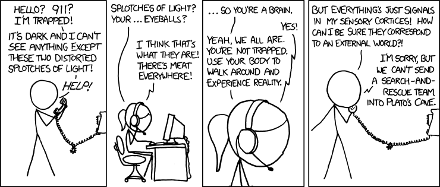

(This page is occasionally updated as the lectures proceed)

## Alex's Lecture 1: The Retina and blind spots

* *Sensation and Perception* textbook by Goldstein (10th or 3rd edition) chapters 1 and 2.

* Stiefel, K., & Holcombe, A. O. (2014). EYES, CAMERA,  ACTION! *Scientific American Mind*, (May/June), 52–58. Available on Canvas.
Explains some features of the retina by comparing it to digital cameras.

#### Optional

* Ramachandran, V.S. “Filling in Gaps in Perception : Part I” *Current Directions in Psychological Science*, 1(6) (Dec., 1992), pp. 199-205. [PDF](https://journals.sagepub.com/doi/pdf/10.1111/1467-9566.ep10770411?casa_token=gk-nAnLdrIEAAAAA:VgV4uYxaAPDJry3c9grbUrBdHy_W5xPuEYRRnGhhBussFk0zOITezSMc2-rQNknjO3-bW828l-wyRcs)

* [Fun illustration](http://xkcd.com/1080/) of visual field and idiosyncrasies of the retina. Although note the following shortcomings of the picture, no doubt due to the creator not being a vision scientist:
    + S-cone, rod scotomas omitted
    + Blood vessels omitted
    + Spatial scaling into periphery for night vision is wrong (not severe enough)
    + Macular pigment omitted (but you don't need to know about macular pigment)
    + Chromatic aberration omitted (but you don't need to know about chromatic aberration)

## Alex's Lecture 2: Signal Detection Theory

* [Appendix D](AppendixD_Sensation_Perception_10th_edition_Signal_detection_theory.pdf) of Goldstein's *Sensation and Perception* 10th edition, “Signal detection theory”

* Blake & Sekuler textbook [excerpt](SDT_Sekuler&Blake(2002).pdf): pp. 553-564, esp. 561-564. 

#### Optional

* [Video lecture](https://www.youtube.com/watch?v=gRQmTp6W3UA) - Signal Detection Theory by Dr. Boaz Ben David 

* [Useful SDT tutorial](http://wise.cgu.edu/wise-tutorials/tutorial-signal-detection-theory/signal-detection-vocabulary-2/), with links to more

* [Understanding z-scores](https://docs.google.com/presentation/d/1sPsRX_07k06j741RToPGsBjMARXRnJ4QXKZYlh9gM3I/edit#slide=id.g1b03eabb46_0_7) slides by Nicole Somebody.

* Wolfe 2013 textbook [pages 11 to 15](SDT_Wolfe(2013).pdf)

* Swets, J. A., Dawes, R. M., & Monahan, J. (2000). Psychological Science Can Improve Diagnostic Decisions. *Psychological Science In the Public Interest*, 1(1), 1-26.  Too long and difficult to be easily digestible, but pretty cool if you're interested.

* Wixted, J. (2019) The forgotten history of signal detection theory. [pdf](http://wixtedlab.ucsd.edu/publications/wixted2019/The_Forgotten_History_of_Signal_Detection_Theory.pdf). Warning: contains math.

## Alex's Lectures 3, 4, 5->5.3: Spatial resolution

* *Perception* by Blake & Sekuler [excerpts](libraryScanOfPerceptionByBlakeSekuler2006SpatialResolutionStuffPp95to99_102to103_and331.pdf) about sensitivity vs. resolution, visual acuity, and blinking, winking, and flickering. <!-- I have the whole textbook in the Readings folder -->
* [Seeing far](SeeingFarPSYC3013_2019.docx), an essay by Alex.
* [Basic Vision by Snowden et al. pp.113-118](SnowdenBasicVision113to118contrastSensitivityFunction.pdf) on the contrast sensitivity function
* *Sensation and Perception* Goldstein textbook (10th edition or 3rd edition) chapter 3
* VSauce's [The Resolution of the Eye](https://www.youtube.com/watch?v=4I5Q3UXkGd0&t=330s). Only one mistake I've noticed in this: him speaking as if viewing distance doesn't matter for the calculation of how many pixels are needed.

<!-- * 
-->

#### Optional

* Side point: there are big differences between us in visual abilities, e.g. [face recognition](http://www.newyorker.com/magazine/2016/08/22/londons-super-recognizer-police-force?mbid=social_twitter)
* Fun regarding acuity relative to iphone resolution: http://blogs.discovermagazine.com/badastronomy/2010/06/10/resolving-the-iphone-resolution/

## Alex's lectures 5.3->6, 6: Temporal resolution

* Persistence of vision [explained by Mr. Wizard](https://www.youtube.com/watch?v=YismwdgMIRc). However, at [1:17](http://www.youtube.com/watch?v=YismwdgMIRc&t=1m17s) he says "Well if it takes a tenth of a second for each of those images to be registered on your brain, what happens if I spin it faster than a tenth of a second?... You'll see both of them; your brain will combine the two". However taking a tenth of a second to be "registered on the brain" refers probably to latency, but what makes your brain combine the two is not how long it takes to reach the brain, but rather how long the signals persist in the brain, which is about temporal resolution, not latency.
* Blake & Sekuler *Perception* p.331 of [excerpts](libraryScanOfPerceptionByBlakeSekuler2006SpatialResolutionStuffPp95to99_102to103_and331.pdf)
* Holcombe blog post. [“Explaining temporal resolution with waterworks”](http://bit.ly/m3eVSu)
* Holcombe (2011) ["Hold your horses- News just in on the speed of sight"](http://theconversation.edu.au/hold-your-horses-news-just-in-on-the-speed-of-sight-760)

#### Optional

* *Time Warp* on the Discovery Channel - [trailer](https://www.youtube.com/watch?v=X0-TbUUXDtM)
* Holcombe (2009). [Seeing slow and seeing fast: Two limits on perception.](Holcombe2009Seeing_slow_and_seeing_fast.pdf) *Trends in Cognitive Sciences*.   

* Most videos and writing you'll find on the internet are very confused about temporal resolution. An example is [Vsauce in his 'What is video?' video](https://www.youtube.com/watch?annotation_id=annotation_2389778551&feature=iv&src_vid=4I5Q3UXkGd0&v=buSaywCF6E8). Considering the errors can help you understand the subtleties: 
    + "How fast does information travel from our eye to the brain?" <- that sounds like latency, but by frame rate he should be talking about rate, not latency.
    + He says: Because our brain holds information for 1/15th of a second, 15 fps will look nice and fluid. That doesn't follow, instead you'd expect to see sudden steps every 1/15th of a second. You wouldn't see any *gaps* because the brain would continue to show the last frame until the next frame, but it should still look stuttery.
    + "If frame rates get higher and higher, you end up with an image that can actually cause headaches when you watch it on a screen". I can't see how that can be true, and his explanation of it doesn't make sense. The brain doesn't "add in motion blur" to make things easier for you. Rather, motion blur is an automatic consequence of the photoreceptors recording the amount of light over an extended interval.
    

## Alex's lecture 7, 8: Touch

* [“Chapter 2: Somatosensory systems”](https://nba.uth.tmc.edu/neuroscience/m/s2/chapter02.html) by Dougherty & Tsuchitani 
* pp.221-5 of Wolfe textbook (3rd edition)
* [The comb illusion](https://alexholcombe.wordpress.com/2014/07/16/tactile-perception-demonstration-the-comb-illusion/)
<!--* Pain chapter, pp. 209-13, Purves et al., Neuroscience, Sinauer. On e-reserve-->
* Wolfe textbook chapter 13 (Touch)

#### Optional

* ["Machines still lack a critical elmement... sense of touch"](https://www.nytimes.com/2014/09/02/science/robot-touch.html?mcubz=0&_r=0)
* A neuroscientific, poetic [essay on touch](https://aeon.co/essays/it-takes-neuroscience-and-poetry-to-map-the-tributaries-of-touch)

(This page is occasionally updated as the lectures proceed)

